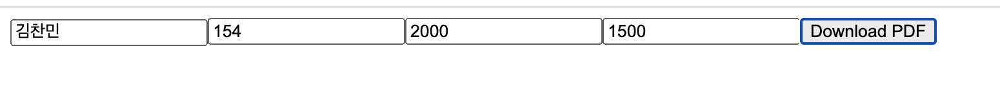

## HTML to PDF converter

[강의 영상 링크](https://www.youtube.com/watch?v=bt1tOhUYxvM&feature=youtu.be) 의 영상을 시청한 후, 약간의 재작업을 통해 완성한 결과물입니다.

### 기능

- 클라이언트에 값을 입력하면 입력한 값을 기반으로 PDF 문서를 생성한 후 다운로드합니다.

### 재작업 내용

**[클라이언트]**

- 함수 컴포넌트로 개선

**[서버]**

- 라우트 미들웨어 파일 별도 분리

### 스크린샷

[클라이언트 폼]  

[ PDF]  

### 후기

개인적으로 아주아주 흥미로운 토이 프로젝트였다고 생각합니다...  
어떻게 응용할 수 있을지는 조금 더 고민해봐야겠어요!
